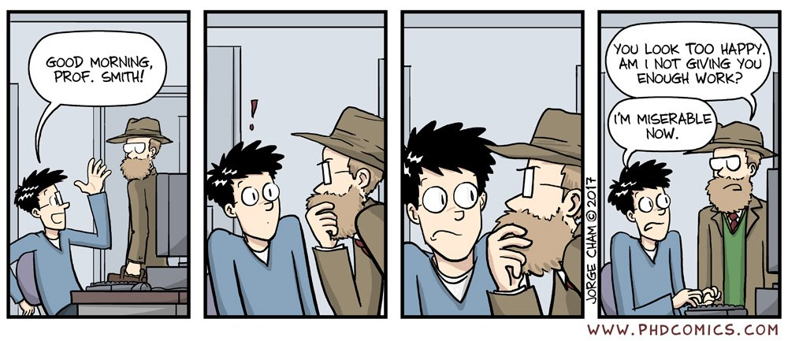

# Hi there! I'm Burak

#

  

- 🔭 I’m a Front-end Developer

- 🌱 I’m currently learning **React, React Native, Next.JS**

# Contact Me

- :email: Email : burakavclar4793@hotmail.com.tr
- :link: Linkedin : [https://www.linkedin.com/](https://www.linkedin.com/in/burak-avcilar-abb14830b/)
- 📝 Medium : [https://itsburakavcilar.medium.com/](https://medium.com/@itsburakavcilar)

# Tools 
<h3 align="left">Languages and Tools:</h3>

             

